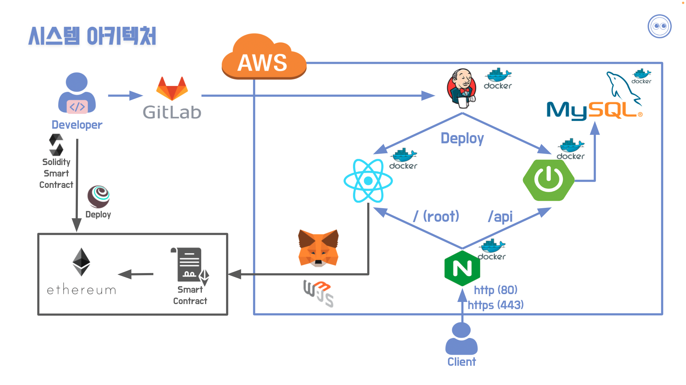

## 소개 😀

✔ 사용자의 추억을 자유롭게 업로드하고 공유할 수 있습니다.

✔ 컨텐츠를 NFT화 하여 **소유(saw you)**, 거래할 수 있는 SNS (Social NFT Service) 서비스입니다.

&nbsp;

## 마스코트 👀

&nbsp;

## 주요 기능 📌

##### 작성한 게시글을 민팅

&nbsp;

##### 보유한 NFT를 판매 등록

&nbsp;

##### 판매중인 NFT를 구매

&nbsp;

##### 구매한 NFT 확인

&nbsp;

## 기술 스택 🛠

#### Back-end

&nbsp;&nbsp;&nbsp;&nbsp;

&nbsp;

#### Front-end

&nbsp;&nbsp;&nbsp;

&nbsp;

#### Smart-Contract

&nbsp;&nbsp;&nbsp;

&nbsp;

#### Server

&nbsp;&nbsp;

&nbsp;

## 개발 기간 📅

##### 2022. 02. 28 ~ 2022. 04. 08 (6주)

&nbsp;

## 팀원 구성 🤝

|                 김정혁 (팀장)                  |                     문준호                     |                     김영후                     |                     이상원                     |                     오나연                     |                     박건우                     |
| :--------------------------------------------: | :--------------------------------------------: | :--------------------------------------------: | :--------------------------------------------: | :--------------------------------------------: | :--------------------------------------------: |
|  |  |  |  |  |  |
|                 Smart-Contract                 |                 Smart-Contract                 |                    Frontend                    |                    Frontend                    |                  Backend, UCC                  |                    Backend                     |

&nbsp;

##  시스템 아키텍쳐 ⚙

&nbsp;

## 바로가기 👉

 

&nbsp;

## 회고 💭

#### 😃 잘하거나 좋았던 점 🧡

✔ **Git활용**을 잘하고, **브랜치**도 잘 나눠서 개발하여 충돌 발생 빈도가 적었다. (master > develop > feature > be/fe/sc)

✔ 어떤 선택에 대한 **근거**를 명확하게 제시하여 팀원을 **설득**하는 과정이 좋았다.

✔ **팀워크**가 엄청 훌륭했고, **소통**이 매우 잘되었다.

&nbsp;

#### 😫 힘들었거나 아쉬웠던 점 💧

✔ 프로젝트 진행 중간에 공부하거나 알게된 부분을 바로 **문서화**하지 못했다. (까먹음)

✔ 기획할 때 세부 기능을 꼼꼼히 나누지 못하여, 개발 후반부에 잦은 bug fix를 해야 했다. (3일동안 6시간 취침)

✔ bug fix로 인해 Refactor 시간이 부족하여 코드 컨벤션을 못 지키고 가독성 좋은 코드를 만들지 못했다.

✔ 기능 구현 전에 Jira를 작성했어야 했는데, 깜빡하고 기능 구현 중간 혹은 완료 후에 Jira를 작성했다.

&nbsp;

#### 🤔 개선할 점 🔥

✔ 기획 때 시간이 걸리더라도 철저히 해서 개발 기간에는 **개발에만 집중**해야 한다.

✔ 코드 작성 시간이 조금 걸리더라도 다른 팀원이 바로 이해할 수 있게 컨벤션을 지키고, **가독성을 좋게** 해야한다.

✔ 코드 작성 시, 주석을 통해 **왜** 이 코드를 사용했는지에 대해 내용을 작성해야 한다.

✔ 새로 알게된 내용, 에러 발생 사항, 실수한 내용에 대해서는 즉시 **문서화**해야 한다.
